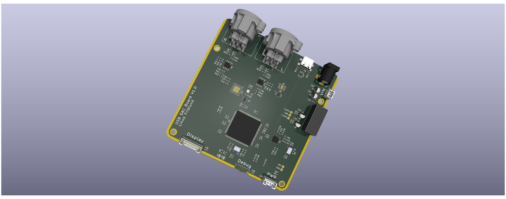

# USB-DAC
A high quality USB audio DAC.
This project is intended as a test for my larger music streamer project that implements a DAC chip together with a STM32 microconroller.
It accepts a music stream over USB, outputs the analog audio over balanced XLR connections and has an OLED display to show stream info. 

Image of a render of the PCBs together with  the case.

## Hardware
The main part of the hardware is the custom developed PCB housing the STM32, DAC chip and its accompanying components

### Microcontroller
A STM32H7 series microcontroller was chosen for its high performance and support for interfaces such as USB HS and SAI (Serial Audio Interface) which are used in the project. In addition I also have previous experience with STM32 based systems. Cost and power consumption were no priorities here since I am only building one unit and it is powered by an external power supply.

### DAC Chip
The DAC chip used is the ESS ES9039Q2M. It is a chip that is widely used in many other DACs meaning other designs are easy to reference. The datasheet includes important info about recommended output stages, power supply schemes and all the neccesary software details. For these reasons, along with its availability online made it a good choice.

### Power supply
A small PSU board with a Mean Well 12V supply feeds into a +-12V switching power supply on the main DAC board. The outptus then get filtered through a ferrite bead and a pi filter before being regulated to +-9V and 3.3V for the analog section. The incoming 12V also gets regulated down with less filtering to 5 and 3.3V for the digital components.

### PCB Design considerations
Extra attention had to be given to a couple of key areas in the PCB design in order to achieve a good result.
#### Stackup
A 4 layer stackup is used with the top and bottom being signal layers and the inner layers being ground and power in order to provide easy routing and better signal integrity.
#### Digital signal integrity
The USB signals and the ULPI signals between the USB PHY and the STM32 both operate at high frequencies and thus require proper impedance and length matching to ensure their functionality. 
#### 

## Software

The software development will start when the hardware is finished and ordered. So far I have only played around a bit and gotten a rough idea of how it will be structured.

## Current status
Currently the hardware design is finished and the PCBs have arrived. Currently the boards are being assembled, then the software development begins!
